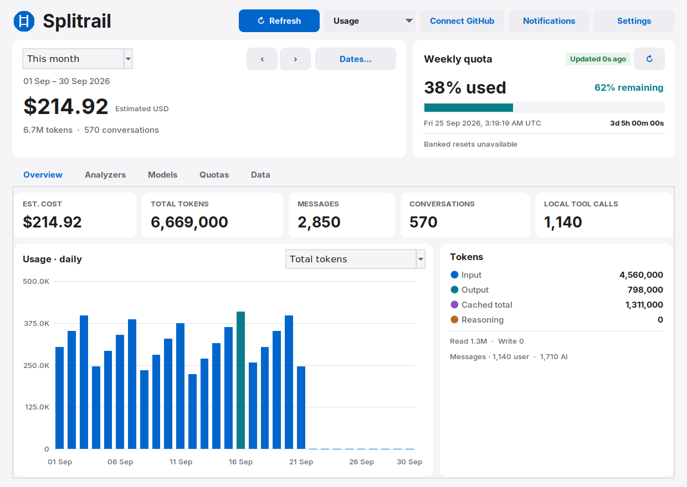
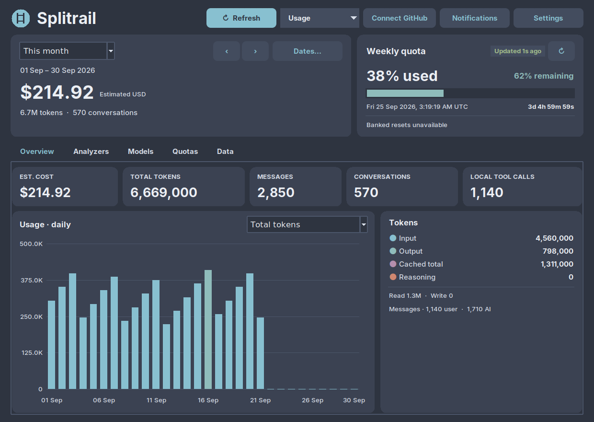
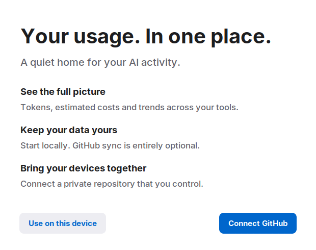

# Splitrail Desktop

A native desktop dashboard for AI token usage and estimated costs, with optional private GitHub sync across your devices. Built with Python and Tk. No web server, telemetry, or Python package dependencies.



- Track usage from Claude, Codex, Gemini, Grok and other tools through the [Splitrail collector](https://github.com/Piebald-AI/splitrail).
- Use the built-in Codex reader without installing Splitrail.
- Explore daily trends, models and dates. Optional Codex quota monitoring stays local.
- Look up 59 built-in model prices or add your own in **Settings → General → Manage model prices**.
- Choose **Pearl**, a light theme with rounded controls, or **Nord**, a soft dark theme.
- Connect your own GitHub account and private repository from **Settings → GitHub sync**.

## Get started

Requires **Python 3.11 or later with Tk 8.6+**. Linux is tested. Windows and macOS are supported by the code paths, but have not yet been tested on those operating systems.

Download `splitrail-desktop.pyz` from this repository's **Releases**, then run:

```bash
python3 splitrail-desktop.pyz
```

On Windows use `python` (or `pythonw` without a console). The official Python installer includes Tk. On Ubuntu/Debian, install `python3-tk`; on Fedora, `python3-tkinter`. On macOS, use a Python distribution that includes Tk.

To run from a downloaded/cloned source checkout:

```bash
python3 splitrail-desktop
```

The first launch offers **Use on this device** or **Connect GitHub**. You can connect later. When the Splitrail executable is available, the dashboard opens in **All devices**; otherwise it opens in **Codex only**. Install [Splitrail 3.9.1 or later](https://github.com/Piebald-AI/splitrail/releases) for all supported local tools. Choose a view from **Usage**.

Try the interface without reading any accounts or usage logs:

```bash
python3 splitrail-desktop --demo
```

Demo data is synthetic, and demo mode cannot connect or sync.

<details>
<summary>Nord theme and first-run setup</summary>




</details>

## Connect devices with GitHub

1. Install [GitHub CLI](https://cli.github.com/) on each device.
2. Open **Settings → GitHub sync**. Choose **Sign in with browser** and enter the displayed one-time code on GitHub. If you already use GitHub CLI, choose **Check connection**.
3. On the first device, choose **Create private repository** and enter a name, such as `splitrail-usage`. On additional devices, choose **Use existing repository** and enter the same `owner/repository`.
4. Choose **All tools** (requires Splitrail) or **Codex only** as this device's source. Review the data-sharing description, check **Allow usage totals and estimated costs to sync**, and choose **Connect**.
5. Choose **Sync now**. Use **Sync** in the dashboard whenever you want to update. Enable **Sync automatically when usage refreshes** if desired; it is off by default.

You can select **Download only on this device**. Disconnecting disables sync and removes downloaded totals from that device; it leaves local source logs, the GitHub CLI sign-in, and your private repository intact. To erase cloud history, delete the private data repository through GitHub. Never make it public: usage dates and costs are still personal data.

Sign-in uses the [GitHub CLI browser flow](https://cli.github.com/manual/gh_auth_login). Splitrail never asks you to paste a token or stores one itself. GitHub CLI manages credentials, using the OS credential store where available. Authentication and networking run in background threads.

### What sync transfers

Each device gets a random identifier, independent of your hostname or account. It writes its own `usage/<random-id>.json` using the [GitHub Contents API](https://docs.github.com/en/rest/repos/contents). Only dates, known model/tool names, token counts, activity counts, and estimated USD costs are serialized. Unrecognized model/tool names are replaced with stable pseudonyms. No prompts, responses, paths, account/quota fields, credentials, diagnostic text, or raw session IDs are sent.

All devices can upload and download. Repeat syncs replace the same device snapshot; unchanged usage does not create another commit. The app uses the repository's default branch, verifies that it is private before transfers, and never creates workflows. Usage commits use a generic identity and `[skip ci]`. No personal Git author configuration is used by the sync transport.

Downloaded snapshots are validated before one atomic cache replacement. Offline or malformed responses preserve the last good totals. Removing a device file from the private repository removes its contribution after the next successful sync.

**Accounting boundary:** sync adds daily aggregates from distinct devices and preserves each sender's cost estimates. It cannot deduplicate copied session logs between devices because the all-tools collector does not provide request identities. Keep each device's source history distinct; do not also manually import the same usage that you sync. Manual Codex imports deduplicate against available local Codex/Pi request identities, independently of aggregate sync. Moving an entire app data directory to another computer also copies the device identity; remove `sync-device.json` and reconnect on the new computer before syncing.

The explicit **Codex only** dashboard includes Codex rows from remote snapshots; **All devices** includes all received tools. Deleted local logs can reduce a later device snapshot. Preserve original logs if you need complete history. The current limits are 100 device files and 8 MB per snapshot. Larger histories need manual export or a future storage backend.

## Pricing

Built-in rates cover common OpenAI/Codex, Anthropic/Claude, Google/Gemini and xAI/Grok models. `model_prices.json` includes provider source links and a verification date. The catalogue is an offline snapshot, not a live pricing feed. Check the provider's current rates before relying on an estimate.

Prices are USD per million tokens. Custom rates override matching models locally; `0` means free, and unused cache fields can stay blank. Existing nonzero collector estimates are preserved unless overridden. Missing costs are filled from the catalogue. Gemini aliases are normalized, cache tokens are charged once, and reasoning already included in output is not charged again.

Unknown models keep their tokens and appear in **Notifications**, with a shortcut to pricing settings. Daily aggregate fallbacks cannot infer request-level long-context premiums, media, paid tools, cache duration, service tiers, or subscription invoices. Synced costs retain the sender's estimate; another device's local price overrides do not rewrite them. Custom rate configuration itself stays local.

## Optional quota monitoring

If `quota-axi` is on your PATH, the app runs `quota-axi --provider codex --full --json` for quota display. If `codex` is available, a read-only app-server query can supply banked-reset information. These tools manage their own authentication. Missing quota tools do not block usage or sync. The app never consumes reset credits or uploads account/quota data.

## Local data and controls

Application data is stored under:

| System | Directory |
| --- | --- |
| Linux | `${XDG_DATA_HOME:-~/.local/share}/splitrail-desktop` |
| Windows | `%LOCALAPPDATA%/splitrail-desktop` |
| macOS | `~/Library/Application Support/splitrail-desktop` |

`preferences.json` stores appearance and onboarding state; `model-prices.json` stores custom rates. `github-sync-v2.json` holds the repository and sync options, `sync-device.json` the random device identity, and `github-devices.json` downloaded aggregates. No credentials are stored by Splitrail. Files are written atomically with user-only permissions where the OS supports them.

The app reads `splitrail stats` without `--include-messages`. The built-in reader scans `CODEX_HOME` (default `~/.codex`) and Codex-authenticated Pi logs in `~/.pi/agent/sessions`, extracting usage records only. It does not modify source logs. Codex totals count input plus output; reasoning is a subset of output.

Manual Codex transfer is available under **Usage → Export usage / Import usage**. Exports contain timestamps, model/source identifiers, token counts, hashed request/session identifiers, and scan metadata. They contain no conversation content. Manual imports merge by request identity and preserve older imported records. Manual export uploads nothing.

Normal refresh starts after launch and repeats every 15 minutes, switching to 5 minutes while usage changes. Automatic GitHub sync runs on these usage refreshes only when explicitly enabled and viewing **All devices** or **Codex only**. The app must remain open. “Updated … ago” reports the quota source's refresh age.

Executable discovery uses PATH and standard per-user install locations. Optional overrides: `SPLITRAIL_BIN`, `QUOTA_AXI_BIN`, `CODEX_BIN`.

## Command line

```bash
python3 splitrail-desktop --codex-usage
python3 splitrail-desktop --export-usage usage.json.gz
python3 splitrail-desktop --import-usage usage.json.gz
python3 splitrail-desktop --setup-sync OWNER/REPO --sync-codex-only
python3 splitrail-desktop --sync-usage
```

CLI setup expects an existing private repository and GitHub CLI sign-in. Add `--receive-only` or `--auto-sync` to opt into those options. GUI setup can create the repository for you.

## Development

```bash
PYTHONPATH=src python3 -m unittest discover -s tests -v
python3 scripts/build.py
python3 dist/splitrail-desktop.pyz --self-check
python3 dist/splitrail-desktop.pyz --smoke-ui
```

A display or Xvfb is needed for GUI checks. Tests use synthetic fixtures and an in-memory GitHub service to exercise multiple devices, privacy enforcement, retries, costs, and cache replacement. Tests never upload real usage. Browser authentication still needs a real GitHub account for a live end-to-end check.

Core modules: `domain.py` aggregates usage, `pricing.py` resolves rates, `portable.py` handles Codex logs, `sync_payload.py` defines the narrow wire format, `sync.py` handles private GitHub transport, and `onboarding.py` provides setup and settings.

This repository begins with a clean source-only history. No runtime data, private configuration, original Git history, or real-account screenshots are distributed. See [PRIVACY.md](PRIVACY.md). Licensed under [MIT](LICENSE). This is an independent interface for Splitrail; it is not affiliated with AI model providers or GitHub.
